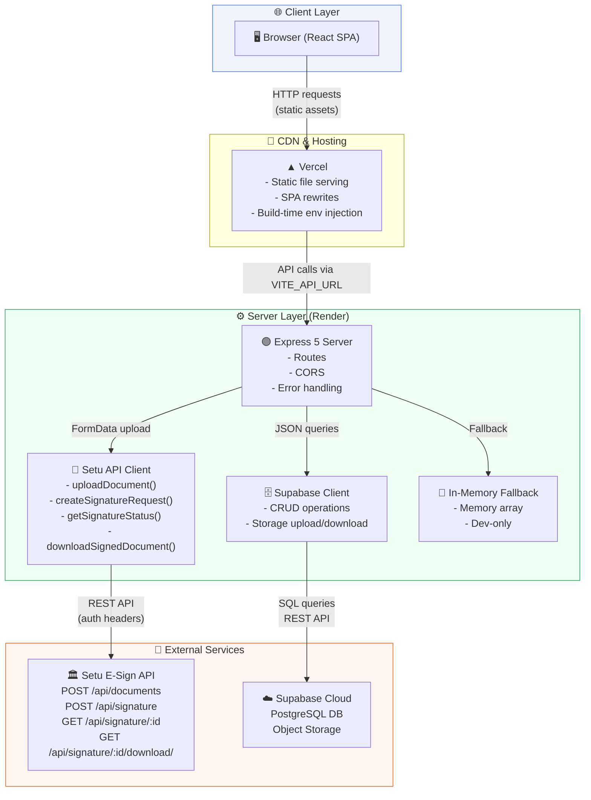
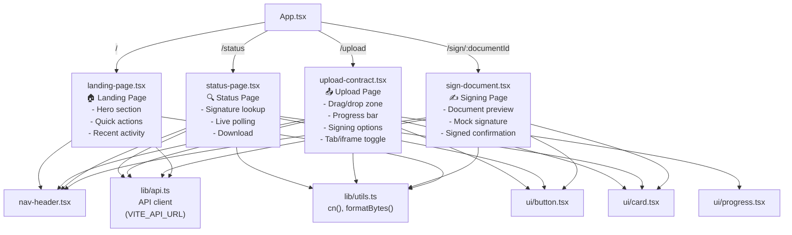
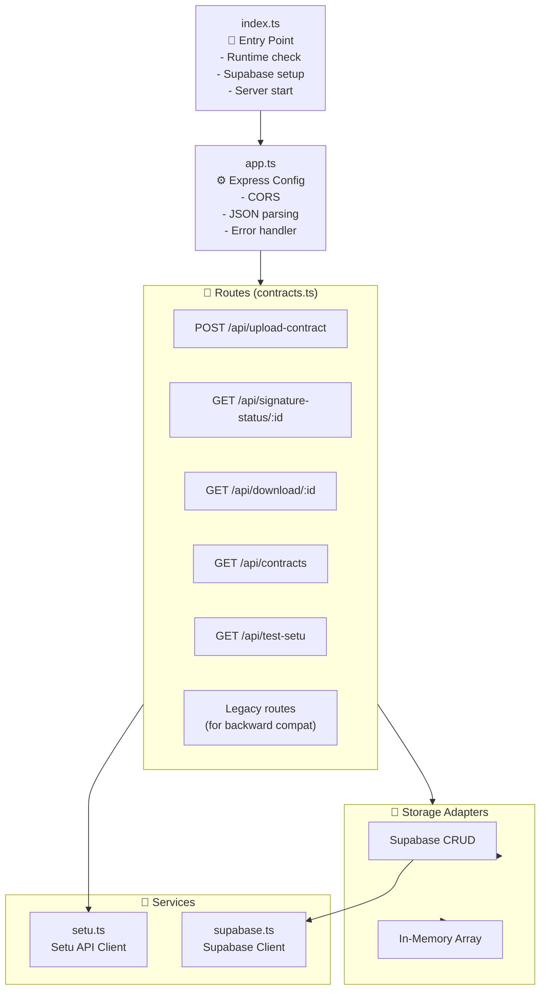
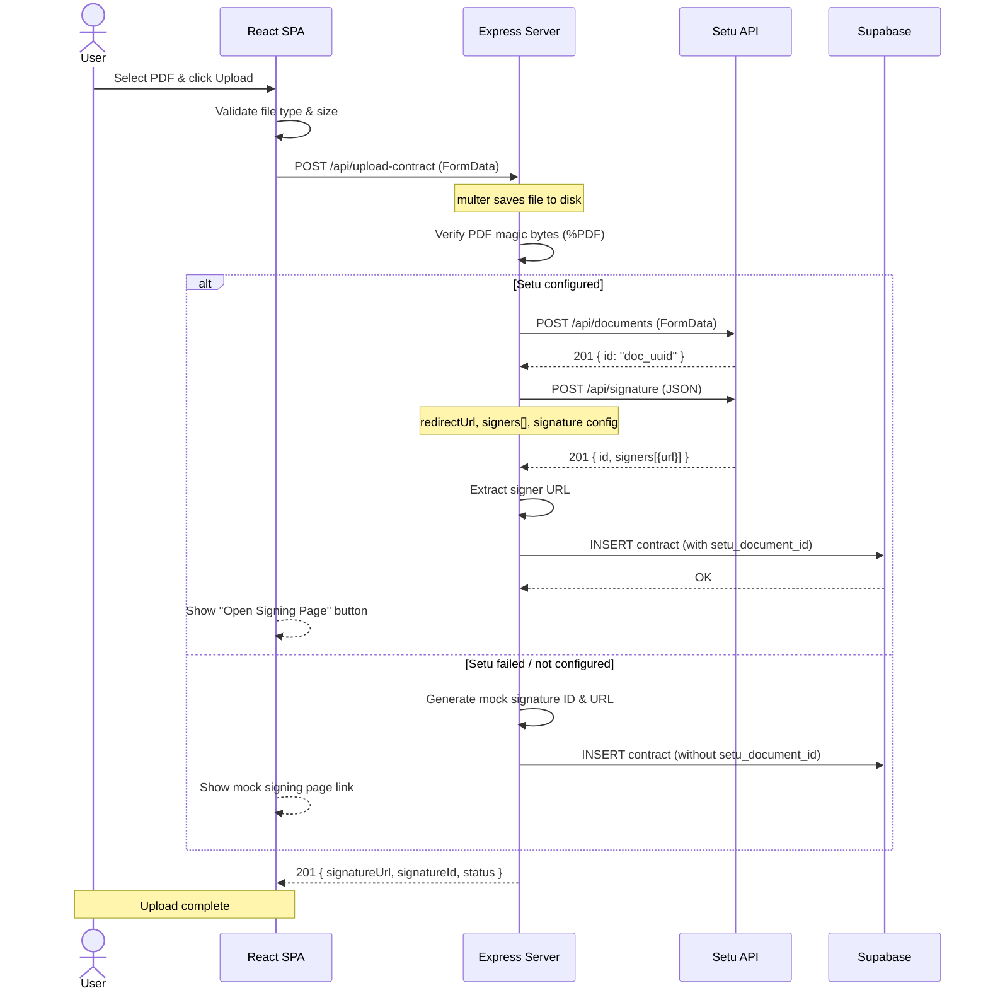
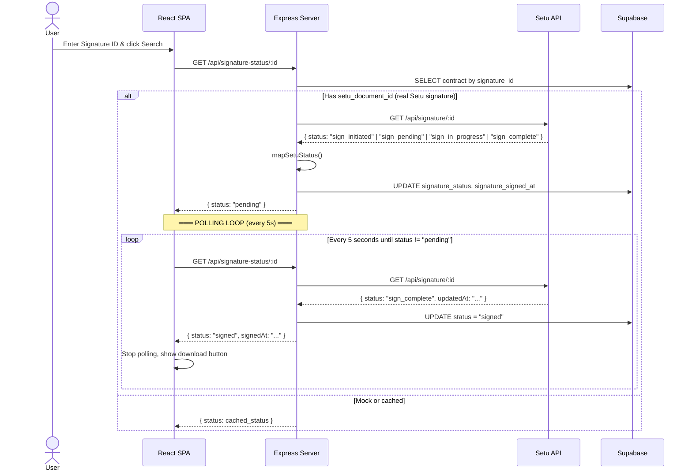
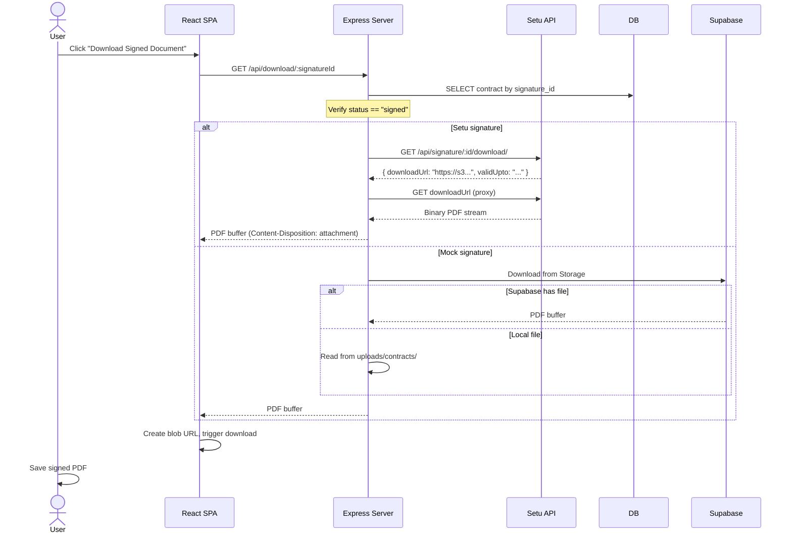

# MangoG — Design Document

> A full-stack document signing platform integrating Setu E-Sign API for Aadhaar-based electronic signatures.

---

## Table of Contents

1. [System Architecture](#1-system-architecture)
2. [Component Design](#2-component-design)
3. [Sequence Diagrams](#3-sequence-diagrams)
4. [Data Model](#4-data-model)
5. [Design Decisions & Trade-offs](#5-design-decisions--trade-offs)
6. [Future Improvements](#6-future-improvements)

---

## 1. System Architecture

### High-Level Diagram



### Layer Responsibilities

| Layer | Responsibility | Resilience |
|-------|---------------|------------|
| **React SPA** | UI rendering, user interactions, file upload | Offline-capable for non-API features |
| **Express Backend** | API routing, file validation, business logic | Graceful degradation (mock → memory → Supabase) |
| **Setu API Client** | E-sign operations, credential management | Falls back to mock signature on any failure |
| **Supabase Client** | Data persistence, file storage | Falls back to in-memory array |
| **In-Memory Store** | Zero-config dev storage | Data lost on restart |

---

## 2. Component Design

### Frontend Component Tree



### Backend Module Structure



---

## 3. Sequence Diagrams

### Upload & Create Signature Request



### Signature Status Polling



### Signed Document Download



---

## 4. Data Model

### PostgreSQL Schema (`contracts` table)

```sql
CREATE TABLE contracts (
  id                BIGSERIAL PRIMARY KEY,
  document_id       TEXT UNIQUE NOT NULL,     -- Our internal doc ID (doc_xxx)
  filename          TEXT NOT NULL,            -- File on disk / storage path
  original_name     TEXT NOT NULL,            -- User's original filename
  size_bytes        BIGINT NOT NULL,          -- File size in bytes
  status            TEXT NOT NULL DEFAULT 'pending'
                    CHECK (status IN ('pending', 'processed', 'failed')),
  uploaded_at       TIMESTAMPTZ NOT NULL DEFAULT NOW(),
  notes             TEXT,                     -- Optional user notes
  signature_id      TEXT UNIQUE NOT NULL,      -- Setu or mock signature ID
  signature_url     TEXT NOT NULL,             -- Setu signing URL or mock URL
  signature_status  TEXT NOT NULL DEFAULT 'pending'
                    CHECK (signature_status IN ('pending', 'signed', 'expired')),
  signature_created_at TIMESTAMPTZ NOT NULL DEFAULT NOW(),
  signature_signed_at   TIMESTAMPTZ,          -- Null until signed
  setu_document_id  TEXT,                     -- Setu's document ID (null for mock)
  storage_file_path TEXT                      -- Supabase storage path
);

-- Indexes for common lookups
CREATE INDEX idx_contracts_signature_id ON contracts(signature_id);
CREATE INDEX idx_contracts_document_id  ON contracts(document_id);
CREATE INDEX idx_contracts_uploaded_at  ON contracts(uploaded_at DESC);
```

### Application Model (TypeScript)

```typescript
interface Contract {
  id: number;
  documentId: string;
  filename: string;
  originalName: string;
  sizeBytes: number;
  status: "pending" | "processed" | "failed";
  uploadedAt: string;
  notes: string | null;
  signature: {
    signatureId: string;
    signatureUrl: string;
    status: "pending" | "signed" | "expired";
    createdAt: string;
    signedAt: string | null;
    setuDocumentId?: string;
  };
}
```

---

## 5. Design Decisions & Trade-offs

### Decision 1: Backend Proxy Pattern

**Choice:** All Setu API calls go through the Express backend. The frontend never calls Setu directly.

**Rationale:**
- API credentials stay server-side (in `.env` or Render env vars)
- Setu's time-limited signed document URLs are never exposed to the client
- A single place to add caching, retries, logging, and error handling
- Consistent CORS policy (only the backend needs CORS, not Setu)

**Trade-off:** Adds latency (every status check goes: Frontend → Backend → Setu → Backend → Frontend). Mitigated by lightweight JSON responses.

### Decision 2: Polling over Webhooks

**Choice:** Frontend polls the backend every 5 seconds to check signature status.

**Rationale:**
- Setu's sandbox API does not provide webhooks
- Polling is simpler to implement and debug
- No infrastructure needed (no webhook endpoint, no event queue)
- 5-second interval balances responsiveness with API usage

**Trade-off:** Higher API usage (12 requests/minute per pending signature). Acceptable for sandbox and low-volume use.

**Future Improvement:** Add a webhook endpoint (`POST /api/setu-webhook`) when Setu's production API supports it. Until then, polling works.

### Decision 3: Dual Storage Pattern

**Choice:** Try Supabase first, fall back to in-memory array on failure.

**Rationale:**
- Zero-config local development (no Docker, no Supabase needed)
- Graceful degradation in production (if Supabase is down, the app still works)
- Each operation tries Supabase → catches error → falls back to memory

**Trade-off:** Data inconsistency if Supabase partially fails (some data in Supabase, some in memory). Mitigated by logging all failures clearly.

### Decision 4: Mock Signature Fallback

**Choice:** When Setu API fails or credentials are missing, generate mock signatures locally.

**Rationale:**
- The app is fully functional without Setu — great for development, demo, and testing
- Mock signatures can be created, checked, and "signed" (status toggled)
- Clean separation: Setu integration is a pluggable module

**Trade-off:** Mock signatures have no legal validity. The frontend clearly distinguishes mock vs real Setu flows via `setuConfigured` flag in the response.

### Decision 5: No ORM

**Choice:** Use the Supabase JS SDK directly instead of Prisma / Drizzle.

**Rationale:**
- The data model has a single table (contracts) — an ORM adds complexity without benefit
- Supabase SDK provides type-safe queries out of the box
- Raw SQL migration is simpler to version and review
- No schema generation step in the build pipeline

**Trade-off:** Schema changes must be manually written as SQL migrations. Acceptable for a single-table schema.

### Decision 6: Inline Route Handlers

**Choice:** All route handlers in a single `contracts.ts` file with storage adapter functions.

**Rationale:** For 10 routes with shared storage logic, a single file is more readable than splitting into 5 files. Storage adapters are small functions at the top of the file, not a separate service layer.

**Trade-off:** If the app grows beyond 20 routes, this should be split into `/routes/contracts.ts`, `/routes/signatures.ts`, and `/storage/adapters.ts`.

---

## 6. Future Improvements

| Feature | Priority | Effort | Notes |
|---------|----------|--------|-------|
| Setu webhook endpoint | Medium | Small | `POST /api/setu-webhook` for instant status updates |
| Supabase Realtime subscriptions | Medium | Medium | Push-based status updates instead of polling |
| Multi-signer support | High | Medium | Allow multiple signers per document |
| Email notifications | Medium | Medium | Integrate SendGrid / Resend for signing links |
| PDF preview in browser | Medium | Large | PDF.js rendering instead of placeholder |
| Rate limiting on upload | Low | Small | Prevent abuse of the upload endpoint |
| Unit tests for Setu client | High | Medium | Jest tests with mocked fetch |
| E2E tests | Medium | Large | Playwright tests for full upload → sign → download flow |
| Audit logging | Medium | Small | Log all signature events with timestamps |
| Docker setup | Low | Small | docker-compose for one-command local setup |

---

*Document generated for MangoG internship submission.*
